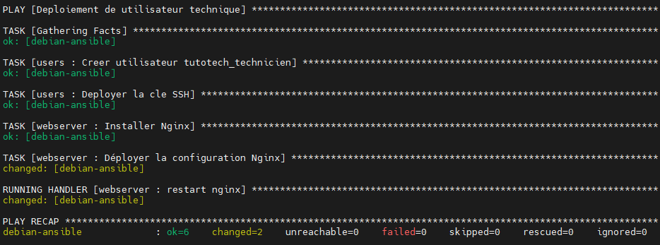
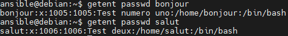
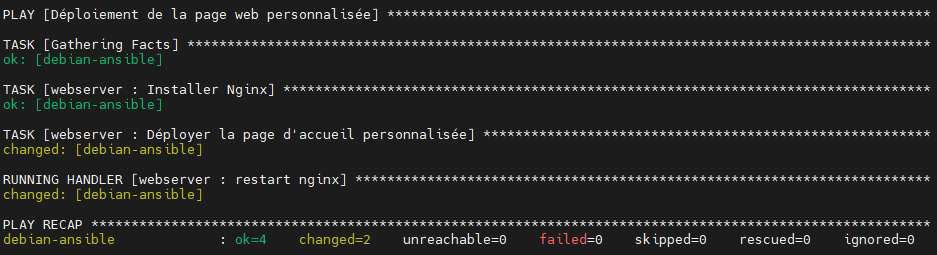
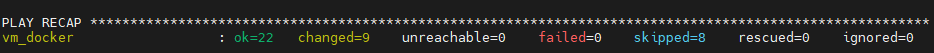
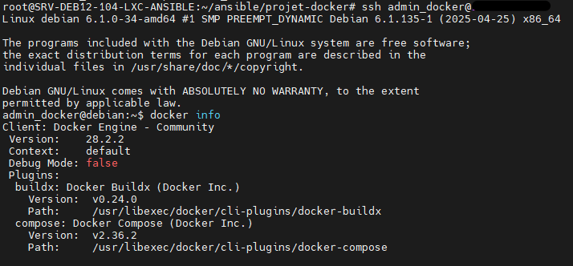
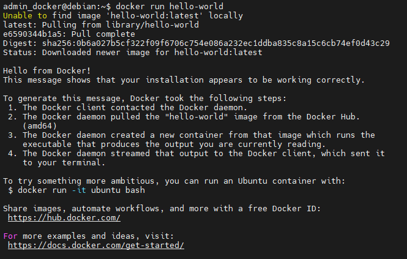
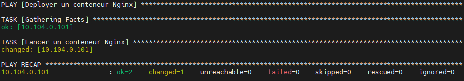
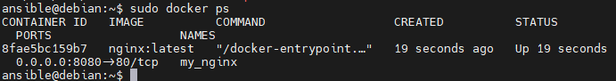
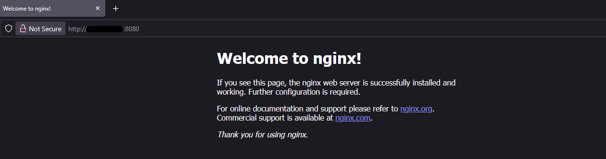

# Installation d'Ansible
## Installation via APT

```bash
apt update && apt full-upgrade -y
apt install sudo ansible
adduser ansible
usermod -aG sudo ansible
ansible --version
```

## Installation via environnement Python

Un environnement Python est un espace isolé dans lequel on peut installer des paquets Python sans interférer avec les autres projets ou avec l’installation Python globale du système. Il permet d'avoir une bulle autonome, propre et facile à supprimer si besoin.

```bash
sudo apt install -y python3 python3-pip python3-venv git sshpass
python3 -m venv ~/.venv/env-ansible # Création de l'environnement
source ~/.venv/env-ansible/bin/activate # Activation de l'environnement
pip install --upgrade pip
pip install ansible
ansible --version
```

### Fonctionnement de l'environnement Python

```bash
python3 -m venv env-ansible
source env-ansible/bin/activate
deactivate # Sortir de l'environnement
```

### Alias dans .bashrc

```bash
echo "alias env-ansible='source ~/.venv/env-ansible/bin/activate'" >> ~/.bashrc
reboot
```

# Configurer la connexion SSH 
## Avec ssh-copy-id

S'assurer que sshd_config est correctement renseigné :

PubkeyAuthentication yes

AuthorizedKeysFile      .ssh/authorized_keys .ssh/authorized_keys2

#PasswordAuthentication no

```bash
sudo adduser ansible (client)
sudo usermod -aG sudo ansible
ssh-keygen -t rsa -b 4096 (serveur)
sudo ssh-copy-id ansible@IP_CLIENT
```

## Avec copie manuelle

```bash
cat ~/.ssh/id_rsa.pub 
copier la clé
```
sur le client : 
```bash
mkdir -p /home/ansible/.ssh
chmod 600 /home/ansible/.ssh
chown ansible:ansible /home/ansible/.ssh
coller la clé dans authorized_keys
```

## Test de connexion

```bash
ssh ansible@IP_CLIENT
```

# Créer un fichier d'inventaire pour Ansible
## Création de l'inventaire
### Ajout du serveur Ansible

```bash
mkdir ~/ansible
cd ~/ansible
nano hosts  # ou hosts.ini, etc.
```
Ajouter les lignes suivantes :
```bash
localhost ansible_connection=local
```

### Ajout du serveur distant Debian 12

```bash
[<nom_du_groupe>]
<alias_du_serveur_distant> ansible_host=<adresse_ip_du_serveur_distant>
ansible_user=<utilisateur_sur_le_serveur_distant>
exemple :
[debian]
debian-ansible ansible_host=IP_CLIENT ansible_user=ansible
```

## Test du bon fonctionnement d'Ansible

```bash
ansible all -m ping
```
Si le chemin vers l'inventaire n'est pas par défaut :
```bash
ansible all -m ping -i /chemin/vers/inventaire
```

# Créer et lancer son premier playbook Ansible
## Ecriture d'un playbook minimal

```bash
mkdir ~/ansible/projet-1/
nano setup.yaml
```

Attention c'est un .yaml, l'indentation est donc extrêmement importante : 

```yaml
- name: Installation de base et création d'utilisateur
  hosts: debian-ansible
  remote_user: ansible
  become: yes
  become_method: sudo

  tasks:
    - name: Installer le paquet htop
      ansible.builtin.apt:
        name: htop
        state: present

    - name: Creer l'utilisateur tutotech_admin
      ansible.builtin.user:
        name: tutotech_admin
        shell: /bin/bash
        create_home: yes

    - name: Autoriser la clé SSH pour tutotech_admin
      ansible.posix.authorized_key:
        user: tutotech_admin
        state: present
        manage_dir: yes
        key: "{{ lookup('file', 'files/id_rsa.pub') }}"
```

Pour que la tâche Autoriser la clé SSH pour tutotech_admin fonctionne il faut au préalable créer un
dossier files et déposer dans ce dossier une clé publique nommée id_rsa.pub :

```bash
cd ansible/projet-1/
mkdir files
cp /root/.ssh/id_rsa.pub /root/ansible/projet-1/files/id_rsa.pub
```

## Exécution du playbook

```bash
ansible-playbook -i ~/ansible/hosts setup.yaml
```

Il est probable que l'erreur suivante apparaisse : 

<p align="center">
    
</p>

Cela signifie que le mot de passe sudo n'a pas été renseigné. 

L’option --ask-become-pass permet d’entrer le mot de passe sudo de l’utilisateur qui va exécuter les
commandes sur le serveur Debian 12 :

```bash
ansible-playbook -i ~/ansible/hosts setup.yaml --ask-become-pass
```

<p align="center">
    
</p>

La première exécution indique toutes les tâches en "changed". 

Si on veut qu'à l'avenir Ansible exécute les commandes sudo sans demander de mot de passe, aller sur le serveur distant :

```bash
echo 'ansible ALL=(ALL) NOPASSWD:ALL' > /etc/sudoers.d/ansible
chmod 440 /etc/sudoers.d/ansible
```

Si on relance le playbook, l'indempotence d'Ansible fait que tout sera OK : 

<p align="center">
    
</p>

## Vérifications sur la machine distante

```bash
htop
cat /etc/passwd|grep tutotech_admin
sudo cat /home/tutotech_admin/.ssh/authorized_keys
```

# Ecrire un playbook Ansible simple

Le but ici est d'utiliser un playbook Ansible pour :
  - installer le logiciel cmatrix
  - créer un utilisateur tutotech_stagiaire
  
```bash
- name: Installation cmatrix et création user
  hosts: debian-ansible
  become: yes
  gather_facts: yes

  tasks:
    - name: Installer cmatrix via apt
      ansible.builtin.apt:
        name: cmatrix
        state: present
        update_cache: yes
      tags: install_cmatrix

    - name: Vérifier que cmatrix est installé
      ansible.builtin.command: which cmatrix
      register: cmatrix_check
      changed_when: false
      tags: verify_cmatrix

    - name: Afficher le résultat de la vérification cmatrix
      ansible.builtin.debug:
        msg: "cmatrix est installé dans {{ cmatrix_check.stdout }}"
      when: cmatrix_check.rc == 0

    - name: Créer le user tutotech_stagiaire
      ansible.builtin.user:
        name: tutotech_stagiaire
        shell: /bin/bash
        create_home: yes
        comment: "Utilisateur pour le TP Ansible"
      tags: create_user

    - name: Vérifier que le user existe
      ansible.builtin.command: "id tutotech_stagiaire"
      register: user_check
      changed_when: false
      ignore_errors: yes
      tags: verify_user

    - name: Afficher le résultat de la vérification utilisateur
      ansible.builtin.debug:
        msg: "Le user tutotech_stagiaire existe (UID: {{ user_check.stdout | regex_search('uid=(\\d+)') | default('N/A') }})"
      when: user_check.rc == 0
```

# Utiliser les rôles Ansible dans un playbook
## Contexte et préparation de la structure du rôle
### Création du répertoire et copie de la clé SSH

```bash
mkdir -p ~/ansible/projet-2/roles
cd ~/ansible/projet-2
ansible-galaxy init roles/users

cp ~/ansible/projet-1/files/id_rsa.pub ~/ansible/projet-2/roles/users/files/
```

### Configuration du rôle (roles/users/tasks/main.yml)

```bash
- name: Créer l'utilisateur tutotech_technicien
  ansible.builtin.user:
    name: tutotech_technicien
    shell: /bin/bash
    create_home: yes
    comment: "Utilisateur technique pour accès SSH"

- name: Déployer la clé SSH
  ansible.posix.authorized_key:
    user: tutotech_technicien
    state: present
    key: "{{ lookup('file', 'id_rsa.pub') }}"
```

### Playbook principal (site.yml)

```bash
- name: Déploiement de l'utilisateur technique
  hosts: SRV-DEB12
  become: yes
  roles:
    - users
```

### Exécution et vérification

```bash
cd ~/ansible/projet-2
ansible-playbook -i ~/ansible/hosts site.yml
```

Sur la machine distante
```bash
id tutotech_technicien

sudo -u tutotech_technicien cat /home/tutotech_technicien/.ssh/authorized_keys
```

# Utiliser un handler dans un playbook Ansible

Se placer dans roles/ et générer le rôle webserver :
```bash
ansible-galaxy init webserver
```

Ajouter les tâches suivantes dans `roles/webserver/tasks/main.yml` :
```bash
---
- name: Installer Nginx
  ansible.builtin.apt:
    name: nginx
    state: present
    update_cache: yes
  notify: restart nginx

- name: Déployer la configuration Nginx
  ansible.builtin.template:
    src: vhost.conf.j2
    dest: /etc/nginx/sites-available/monsite.conf
  notify: restart nginx

```

Télécharger le fichier de template Jinjia2 :
```bash
curl -o ~/ansible/projet-2/roles/webserver/templates/vhost.conf.j2
https://raw.githubusercontent.com/geerlingguy/ansible-role-nginx/blob/master/templates/vhost.j2
```

Ajouter le handler pour redémarrer Nginx dans `roles/webserver/handlers/main.yml` :
```bash
---
- name: restart nginx
  ansible.builtin.service:
    name: nginx
    state: restarted

```

Modifier le site.yml pour inclure le rôle webserver :
```bash
- hosts: webservers
  become: yes
  roles:
    - webserver
```

L'exécution du playbook peut renvoyer une erreur nginx_listen_ipv6. Si c'est le cas, dans roles/webserver/vars/main.yml, ajouter la ligne :
```bash
nginx_listen_ipv6: "off"
```

Lancer le playbook :
```bash
ansible-playbook -i ~/ansible/hosts ~/ansible/projet-2/site.yml
```

<p align="center">
    
</p>

# Utiliser les variables dans un playbook
Dans le dossier `roles/`, lancer la création du rôle `users`si ce n'est pas déjà fait :
```bash
ansible-galaxy init users
```

Dans `roles/users/defaults/main.yml`, ajouter la variable `users_list` contenant une liste d'utilisateurs à créer :
```bash
---
users_list:
  - name: bonjour
    shell: /bin/bash
  - name: salut
    shell: /bin/bash
```

Adapter les tâches en éditant `roles/users/tasks/main.yml` :
```bash
- name: Créer les utilisateurs
  ansible.builtin.user:
    name: "{{ item.name }}"
    shell: /bin/bash
    create_home: yes
    comment: "{{ item.comment }}"
  loop: "{{ users_list }}"

- name: Déployer la clé SSH
  ansible.posix.authorized_key:
    user: "{{ item.name }}"
    state: present
    key: "{{ lookup('file', 'id_rsa.pub') }}"
  loop: "{{ users_list }}"
```

Surcharger la variable dans le playbook en éditant `site.yml` et en remplaçant la partie roles :
```bash
- hosts: all
  become: true
  roles:
    - role: users
      vars:
        users_list:
          - name: bonjour
            comment: "Test numero uno"
          - name: salut
            comment: "Test deux"
```

Exécuter le playbook :
```bash
ansible-playbook -i ~/ansible/hosts ~/ansible/projet-2/site.yml
```

<p align="center">
    
</p>

Vérifier sur l'autre machine : 

<p align="center">
    
</p>

# Déployer une configuration personnalisée via un template Jinja2

Créer un nouveau projet :
```bash
mkdir -p projet-3/roles/webserver/{tasks,handlers,templates}
touch projet-3/site.yml
touch projet-3/inventory.ini
cd projet-3
```

Définir l'inventaire :
```bash
nano inventory.ini

[webservers]
debian-ansible ansible_host=ADRESSE_IP ansible_user=USER
```

Créer le playbook `site.yml` :
```bash
---
- name: Deploiement de la page web personnalisée
  hosts: web
  roles:
    - webserver
```

Renseigner le fichier `roles/webserver/tasks/main.yml` :
```bash
---
- name: Installer Nginx
  ansible.builtin.apt:
    name: nginx
    state: present
    update_cache: yes

- name: Deployer la page d'accueil personnalisee
  ansible.builtin.template:
    src: index.html.j2
    dest: /var/www/html/index.html
    mode: '0644'
  notify: restart nginx
```

Renseigner le fichier `roles/webserver/handlers.main.yml` :
```bash
---
- name: restart nginx
  ansible.builtin.service:
    name: nginx
    state: restarted
```

Créer le fichier `roles/webserver/templates/index.html.j2` (Rendre la page jolie est en option 😁) :
```html
<!DOCTYPE html>
<html lang="fr">
<head>
  <meta charset="UTF-8" />
  <title>Salut tout le monde</title>
  <style>
    body {
      font-family: Arial, sans-serif;
      background: linear-gradient(to bottom right, #1e3c72, #2a5298);
      color: #fff;
      margin: 0;
      padding: 0;
      display: flex;
      justify-content: center;
      align-items: center;
      height: 100vh;
      text-align: center;
      flex-direction: column;
    }

    h1 {
      font-size: 2.5em;
      margin-bottom: 0.5em;
    }

    p {
      font-size: 1.2em;
    }
  </style>
</head>
<body>
  <h1>Salut, bienvenue chez Ncls-d !</h1>
  <p>Deploiement automatique avec Ansible  ^=^r  ^=^z^`</p>
</body>
</html>
```

Exécuter le playbook :
```bash
ansible-playbook -i inventory.ini site.yml
```

<p align="center">
    
</p>

<p align="center">
    
</p>

# Installer Docker avec Ansible

Créer un nouveau projet 
```bash
mkdir -p projet-docker
cd projet-docker
touch install_docker.yml inventory.ini
```

Ajouter le rôle geerlingguy.docker :
```bash
ansible-galaxy install geerlingguy.docker
```

Créer l'inventaire `inventory.ini` :
```bash
[docker]
vm_docker ansible_host=IP_CIBLE ansible_user=USER ansible_ssh_private_key_file=~/.ssh/id_rsa
```

Créer le playbook `install_docker.yml` :
```bash
---
- name: Installer Docker et configurer l'utilisateur
  hosts: docker
  become: true
  vars:
    docker_users:
      - admin_docker
  roles:
    - geerlingguy.docker

  tasks:
    - name: Créer l'utilisateur admin_docker
      ansible.builtin.user:
        name: admin_docker
        groups: docker
        append: yes
        shell: /bin/bash

    - name: Créer le dossier .ssh pour admin_docker
      ansible.builtin.file:
        path: /home/admin_docker/.ssh
        state: directory
        owner: admin_docker
        group: admin_docker
        mode: '0700'

    - name: Copier une clé publique SSH (si tu veux te connecter en SSH)
      ansible.builtin.copy: (à remplacer si vous préférez un mdp)
        src: ~/.ssh/id_rsa.pub
        dest: /home/admin_docker/.ssh/authorized_keys
        owner: admin_docker
        group: admin_docker
        mode: '0600'
```

Lancer le playbook :
```bash
ansible-playbook -i inventory.ini install_docker.yml
```

Vérifications :
ssh admin_docker@IP_CIBLE
docker info
docker run hello-world

<p align="center">
    
</p>

<p align="center">
    
</p>

<p align="center">
    
</p>

# Déployer un conteneur Docker avec Ansible

Installer la collection community.docker :
```bash
ansible-galaxy collection install community.docker
```

Configurer le fichier d'inventaire `hosts.ini` :
```bash
[docker_hosts]
IP_CIBLE ansible_ssh_user=USER ansible_ssh_private_key_file=~/.ssh/id_rsa
```

Vérification de la connexion SSH :
```bash
ansible -i hosts.ini docker_hosts -m ping
```

Si tout est configuré correctement, la réponse obtenue ressemble à :
```bash
IP_CIBLE | SUCCESS => {
    "changed": false,
    "ping": "pong"
}
```

Créer le playbook pour déployer un conteneur Docker (nginx) :
```bash
---
- name: Déployer un conteneur Nginx
  hosts: docker_hosts
  become: true
  collections:
    - community.docker
  tasks:
    - name: Lancer un conteneur Nginx
      community.docker.docker_container:
        name: my_nginx
        image: nginx:latest
        state: started
        ports:
          - "8080:80"
        env:
          NGINX_HOST: "localhost"
          NGINX_PORT: "8080"
```

Lancer le playbook :
```bash
ansible-playbook -i hosts.ini deployer_conteneur_nginx.yml
```

<p align="center">
    
</p>

Vérifications :

Sur la machine cible : 
<p align="center">
    
</p>

Sur le port 8080 : 
<p align="center">
    
</p>