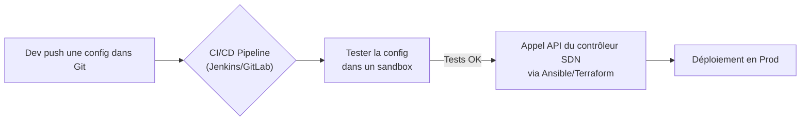

# Veille Technologique : Intégration de DevOps avec SDN

## Introduction : DevOps et SDN, pourquoi les marier ?

Le DevOps vise à accélérer la livraison des applications en automatisant et en fluidifiant les processus entre le développement et les opérations. Traditionnellement, le réseau a été un frein à cette agilité, étant souvent manuel, rigide et lent à provisionner.

Le **SDN (Software Defined Networking)** apporte la solution en rendant le réseau programmable via des APIs, faisant de lui une ressource agile qui peut être gérée comme du code. L'intégration de ces deux mondes, souvent appelée NetDevOps ou DevNetOps, est essentielle pour réaliser le cycle CI/CD de bout en bout, des serveurs au réseau.

---

## Concepts clés à maîtriser

- **Infrastructure as Code (IaC) pour le réseau** : Gestion de la configuration réseau (VLAN, ACL, firewall) via des fichiers code (YAML, JSON) versionnés dans Git.
- **Réseau Déclaratif vs Impératif** :
  - *Impératif* : Donner une séquence de commandes à exécuter ("Fais ceci, puis cela").
  - *Déclaratif* : Décrire l'état final souhaité ("Je veux que cette app soit accessible sur le port 443") et laisser le système l'implémenter.
- **CI/CD pour le réseau** : Utilisation de pipelines (Jenkins, GitLab CI) pour tester et déployer automatiquement les changements de configuration réseau.
- **APIs et Contrôleurs SDN** : Le contrôleur SDN (ex : VMware NSX, Cisco ACI) expose des APIs REST qui permettent aux outils d'automatisation de piloter le réseau.

---

## Bénéfices de l'intégration

- **Vitesse et Agilité** : Provisionnement du réseau en secondes via une API.
- **Cohérence et reproductibilité** : Déploiement identique et reproductible de l'environnement réseau.
- **Réduction des Erreurs** : Élimination des erreurs humaines grâce à l'automatisation.
- **Sécurité "Shift Left"** : Intégration des politiques de sécurité réseau directement dans le pipeline de déploiement de l'application.
- **Résilience** : Recréation rapide de l'environnement en cas de incident.

---

## Outils et technologies

### Plateformes SDN
- **VMware NSX-T** : Leader pour les clouds privés/virtuels, excellente intégration Kubernetes.
- **Cisco ACI** : Solution centrée sur les datacenters.
- **Projets open-source** : OpenDaylight (contrôleur SDN), Tungsten Fabric.

### Orchestrateurs de conteneurs
- **Kubernetes** : Le standard de fait. Son modèle réseau (CNI - Container Network Interface) s'appuie sur des plugins SDN (Calico, Cilium, Weave Net).

### Outils d'automatisation IaC
- **Ansible** : Idéal pour l'automatisation réseau, nombreux modules dédiés.
- **Terraform** : Provisionnement déclaratif d'infrastructures réseau (via providers NSX, ACI, cloud).
- **Pulumi** : Définition de l'IaC avec de vrais langages de programmation (Python, Go).

### Relation SDN / SD-WAN
Le **SD-WAN est une application concrète du concept SDN** appliquée au réseau étendu. Il utilise les mêmes principes : centralisation du contrôle (via un orchestrator cloud), programmabilité via API et abstraction des liens sous-jacents. Des solutions comme **Silver Peak**, Cisco SD-WAN ou VMware SD-WAN sont ainsi des briques SDN prêtes pour une intégration DevOps.

---

## Cas d'usage concrets

**Microservices et Kubernetes** : Lors du déploiement d'un nouveau service, le plugin CNI (e.g., Cilium) configure automatiquement les politiques réseau (NetworkPolicies) pour isoler le trafic.

**Pipelines CI/CD de réseau** :

**Cloud Hybride** : Automatisation du déploiement de connexions sécurisées (VPN, SD-WAN) entre cloud public et datacenter on-premise de manière cohérente.

---

## Tendances et avenir : GitOps, NetDevOps, Security

- **GitOps pour le réseau** : L'état désiré du réseau est déclaré dans un Git. Un opérateur (ArgoCD, Flux) s'assure que l'état réel concorde avec le repo.
- **Émergence du rôle NetDevOps** : Profil hybride expert à la fois en réseau et en outils DevOps (Ansible, Python, APIs).
- **Zero Trust Networking** : Implémentation de politiques de sécurité granulaires et dynamiques ("ce microservice ne peut parler qu'à cet autre").
- **Observability** : Centralisation des métriques, logs et traces du réseau pour mieux le comprendre et le debugger.

---

## Ressources  utilisées

En français :
- https://www.lemagit.fr/conseil/SDN-et-DevOps-les-experts-reseaux-a-un-tournant-historique
- https://www.juniper.net/fr/fr/research-topics/what-is-devnetops.html
- https://blog.jbriault.fr/netdevops-quand-le-devops-se-met-au-reseau/

En anglais :
- https://www.alibabacloud.com/tech-news/a/sdn/1oshjvcoaz-the-sdn-devops-nexus
- https://devops.com/devops-care-sdn/
- https://datascientest.com/en/all-about-netops
- /r/networking, /r/devops
